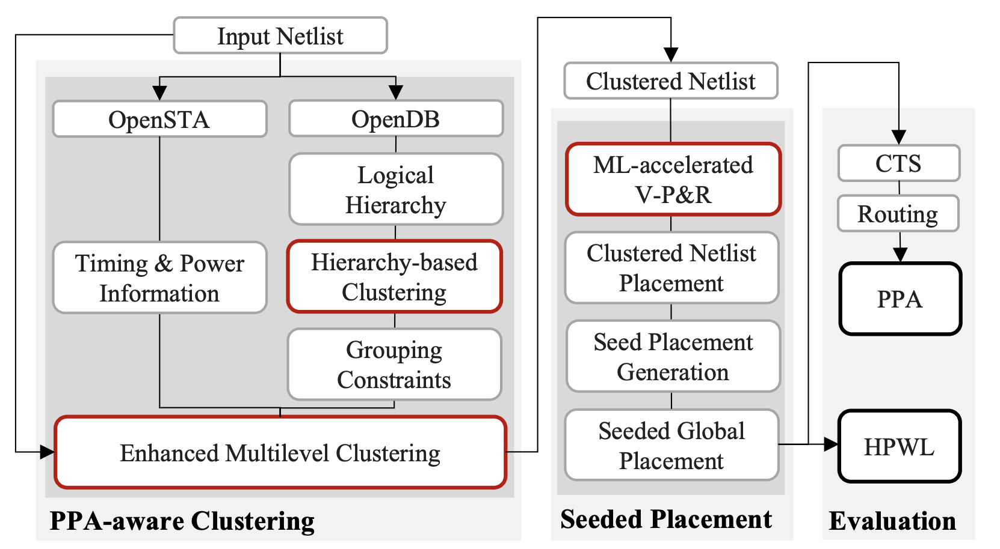

# BlobPlace #

BlobPlace is a PPA-relevant clustering-driven placement framework for large-scale VLSI designs. 
This repository contains the codes for our DAC'24 [paper](https://vlsicad.ucsd.edu/Publications/Conferences/410/c410.pdf). 



To install the BlobPlace flow, you need to do the following: 
* Install the latest version of OpenROAD
* Replace the ```src/par``` directory with ```src``` provided in our repository
* Create a build directory
* Run ```cmake ..```
* Run ```make -j```
